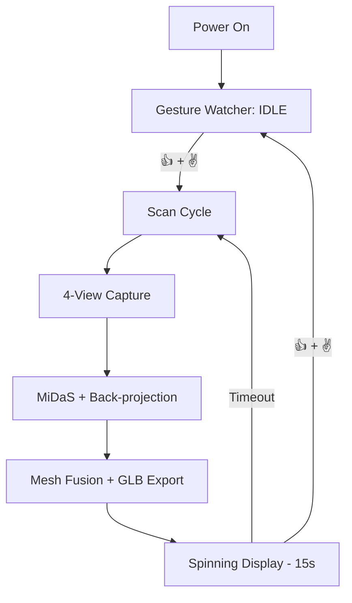

# NeRF-Axis: Autonomous 3D Scanning Methodology

This document outlines the technical architecture and engineering trade-offs for the `nerf_scan` autonomous pipeline on Raspberry Pi 4B (armv7l).

## 1. Technical Rationale

### 1.1 Capture & Inference Resolution
- **Resolution**: Native capture at **256×256**.
- **Rationale**: The MiDaS v2.1 Small model utilizes a fixed 256×256 input tensor. Capturing at higher resolutions (e.g., 1080p) and downscaling in Python introduces significant latency due to memory copies and interpolation overhead. By setting the `picamera2` sensor mode to a square crop at native model resolution, we achieve **zero-overhead inference prep**.
- **Optimization**: We avoid `rembg` (ONNX/PyTorch) which is unstable on 32-bit Pi. Instead, we use **OpenCV GrabCut** initialized with a central rectangle. This performs background removal in ~200ms vs ~8s for neural alternatives.

### 1.2 The "Zero-Loop" 3D Renderer
- **Native TFT Alignment**: The ST7735 is 128×160. By using a `MESH_STEP=2` on our 256×256 depth map, we generate a grid of exactly **128×128** vertices. 
- **Compute Efficiency**: Standard Python loops for 3D projection are too slow. This pipeline uses **Pure NumPy Vectorization**:
  - Vertex transformation (rotation/perspective) is handled via matrix operations.
  - Z-sorting uses `np.argsort`.
  - The final frame is blitted into a pre-allocated NumPy `uint8` buffer.
- **Result**: ~25-30 FPS wireframe/point-cloud rotation on a Pi 4 without hardware GL.

### 1.3 Gesture-Based State Machine
- **No Physical Buttons**: The device is autonomous and "touchless".
- **Activation Sequence**: 
  1. `THUMBS_UP` (👍): Detected via convexity defects (0 deep valleys).
  2. `V_SIGN` (✌️): Detected via convexity defects (1 deep valley between index/middle).
- **Implementation**: Pure HSV skin segmentation + Contour analysis. Extremely low CPU footprint compared to MediaPipe/TensorFlow Gesture.

## 2. System Flow

## 3. Usage & Deployment

### 3.1 Standalone Setup
To make the scanner start automatically on boot:
1. Run `bash ~/pi_scan/nerf_scan/setup_service.sh`.
2. This installs a `systemd` unit that targets `python3 -m nerf_scan.main`.

### 3.2 Web Viewing
Access the scan results from any device on the network:
- **URL**: `http://gp5.local:8080/`
- **Feature**: Uses Google's `<model-viewer>` for high-quality PBR rendering of the generated GLB.

## 4. Engineering Trade-offs
- **Precision vs. Speed**: We subsample 16,384 vertices down to ~2,000 for the TFT preview to maintain interactivity, while the full-resolution mesh is saved to `current_mesh.glb`.
- **Memory**: By using `pygltflib` with base64 buffers, we avoid large temporary `.obj` or `.ply` files, keeping disk I/O to a minimum.
